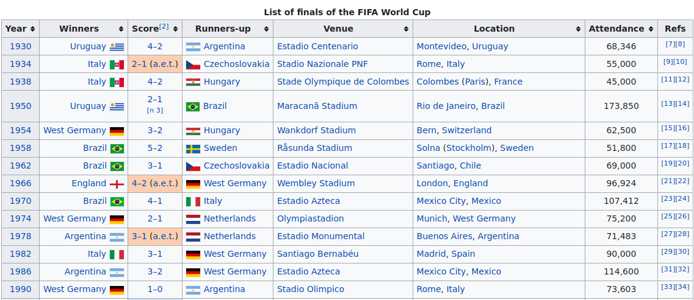
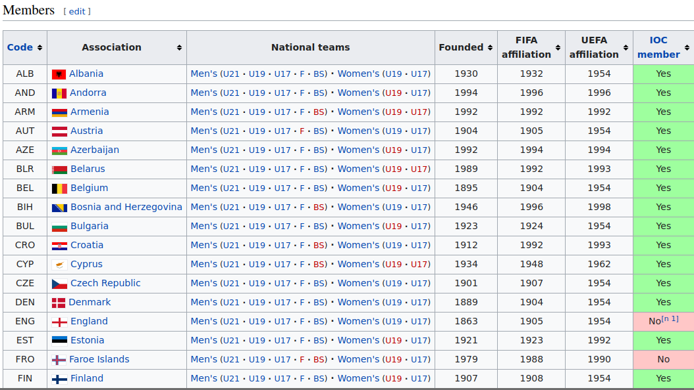
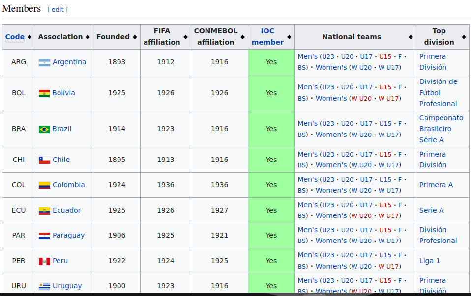
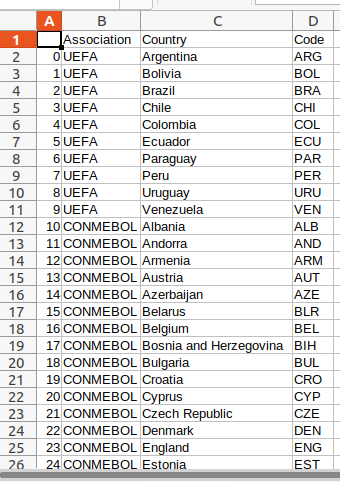
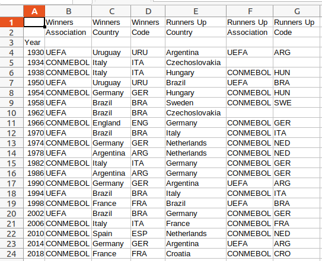
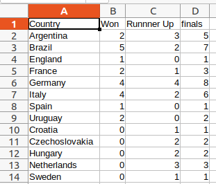
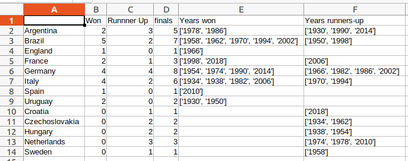

# FIFA PROJECT

## Introduction
The goal of this project is to extract FIFA data from:

1. [Wikipedia FIFA data](https://en.wikipedia.org/wiki/List_of_FIFA_World_Cup_finals)
1. [UEFA data](https://en.wikipedia.org/wiki/UEFA)
1. [CONMEBOL data](https://en.wikipedia.org/wiki/CONMEBOL) 

And to combine all the data into one table to make it easier to see all necessary FIFA data in one glance

## Steps
* Scrape data from Wikipedia
* Use pandas and numpy to combine, reshape and merge the tables

## Tables







## Code
### Step 1: Data Extraction
---
I first extract the list of FIFA finals tables from the Wikipedia FIFA tables page.
```python
    # Wikipedia article is List of FIFA World Cup finals
    import pandas as pd
    import numpy as np

    # Scraped all the tables in the fifa winners wiki page and stored them in a list
    tables = pd.read_html('https://en.wikipedia.org/wiki/List_of_FIFA_World_Cup_finals')

    # Get the list of FIFA finals table
    fifa_tables = tables[3]
    print(fifa_tables)
```
I then scrape UEFA data
```python
    # Importing UEFA association information
    uefa_list = pd.read_html('https://en.wikipedia.org/wiki/UEFA')

    # Isolating UEFA member country table
    uefa = uefa_list[3].copy()
    print(uefa)
```
I finally scrape CONMEBOL data
```python
    # Getting CONMEBOL information
    conmebol_tables = pd.read_html('https://en.wikipedia.org/wiki/CONMEBOL')

    # Isolating table with country and country code information
    conmebol = conmebol_tables[4].copy()
```

### Step 2: Getting Necessary data from scraped data
---
I then extract the useful columns (Winners, Runners up and Year) from the list of fifa finals table
```python
    # Getting a copy of the list of finals table to work with
    finals_tabel = fifa_tables.copy()

    # Changing the index of finals_table to year
    finals_tabel.set_index('Year', inplace=True)

    # Reindexing to get necessary tables: Winners and Runners-up
    finals_tabel_useful = finals_tabel.reindex(columns=['Winners', 'Runners-up'])
```
I then remove unnecesary rows from the extracted columns
```python
    # Removing unnecessary rows: Upcoming finals, Year, 2022, 2026
    finals_tabel_useful = finals_tabel_useful.drop(index=['Upcoming finals', 'Year', '2022', '2026'])

    # Since West and East Germany combined to from Germany we replace West Germany with Germany
    finals_tabel_useful.replace('West Germany', 'Germany', inplace=True)
    print(finals_tabel_useful)
```
I get useful columns from UEFA and conmbel data (Association and Code)
```python
    # Get useful columns from uefa
    uefa_useful = uefa.reindex(columns=['Association', 'Code'])
    print(uefa_useful.head())

    # Reindexing to only have Association and Code columns
    conmebol_useful = conmebol.reindex(columns=['Association', 'Code'])
    print(conmebol_useful)
```

### Step 3: Data Concatenation
---
I combine the UEFA and CONMEBOL data to get one big table containing association data
```python
    # Concatenate the 2 association dataframes along index
    associations = pd.concat([conmebol_useful, uefa_useful], keys=['UEFA', 'CONMEBOL'])

    # I reset the index so that each entry will have the association it belongs to
    associations.reset_index(inplace=True)

    # Remove unnecesary columns
    associations = associations.drop(columns=['level_1'])

    # Renaming columns to more sensible names
    associations.rename(columns={
        'level_0':'Association',
        'Association': 'Country'
    }, inplace=True)
    print(associations)
```
This produces an association table that looks like this:


I then combine the association and list of fifa finals data to form one big table that has the county code, association, and country for every fifa finals game
```python
    # Merge finals_table_useful and associations to form winners table that has the countries that won the world cup and their country code
    winners_merged = pd.merge(finals_tabel_useful, associations, left_on='Winners', right_on='Country', how='left')
    winners_merged = winners_merged.drop(columns=['Runners-up', 'Winners'])

    # Repeat to get runners up table with country and code
    runners_up_merged = pd.merge(finals_tabel_useful, associations, how='left', left_on='Runners-up', right_on='Country')
    runners_up_merged = runners_up_merged.drop(columns=['Winners', 'Country'])

    # Renaming runners-up column to Country
    runners_up_merged.rename(columns={
        'Runners-up': 'Country'
    }, inplace=True)

    # Concatenate the winners and runners-up dataframes
    finals_concatenated = pd.concat([winners_merged, runners_up_merged], axis=1, keys=['Winners', 'Runners Up'])

    # Setting years as index of finals_concatenated
    finals_concatenated.index = finals_tabel_useful.index
    print(finals_concatenated)
```
This table looks like this:


### Step 4: Grouping Data
---
I then group the winners and runners up dataframes by Country to get the number of times a county has won, been a runner up and the total number of times its been in the finals
```python
    # Grouping winners_merged and runners_up_merged by Country
    winners_group = winners_merged.groupby('Country')
    runners_group = runners_up_merged.groupby('Country')

    # Getting size of the groups and storing in df
    number_won = winners_group.size()
    number_runner_up = runners_group.size()
    number_won.name = 'Won'
    number_runner_up.name = 'Runnner Up'

    # Concatenating the 2 dataframes
    runners_winners_merged = pd.concat([number_won, number_runner_up], join='outer', axis=1)
    runners_winners_merged['finals'] = runners_winners_merged.sum(axis=1)
    runners_winners_merged = runners_winners_merged.fillna(0)
    print(runners_winners_merged)
```
The resulting table looks like this:


I then want to get from list of fifa winners table a list of the years won and runners up for every country
```python
    # Have final_tables_useful - winning country, runners up and year. I want to get years won for every country and years runner up for every county
    print(finals_tabel_useful)
    # Group df by winning column to get info per country
    winning_group = finals_tabel_useful.groupby('Winners')

    # Extract index from group and store in a dictionary, key is country name and data is list of years
    years_won = {country: group.index.to_list() for country, group in winning_group}

    # Convert years_won to a series that I will later concat with runnners_winners_merged
    years_won = pd.Series(years_won)
    years_won.name = 'Years won'

    # Repeat for runners up
    runners_up_group = finals_tabel_useful.groupby('Runners-up')
    years_runners_up = {country: group.index.to_list() for country, group in runners_up_group}
    years_runners_up = pd.Series(years_runners_up, name='Years runners-up')
    print(years_runners_up)
```
### Step 5: Combining all the tables to get the final result
---
I combine data for countries that reached world cup finals ,years they won and were runners up and the number of times they won, became runner up or reached finals
```python
    # Concatenate runners_winners_merged with years_won and years_runner_up
    results_by_nation = pd.concat([runners_winners_merged, years_won, years_runners_up], axis=1, join='outer')
    print(results_by_nation)
```
The final table looks like this:
